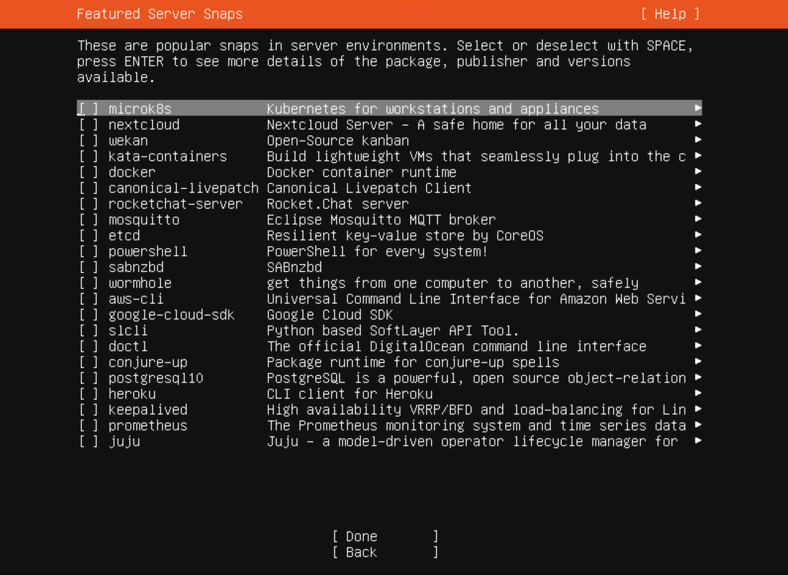

# What's This?
- インストールされた直後の Ubuntu 22.04 Server を初期設定して，Docker を自動的にインストールすることができます．
- なお，Ubuntu Server のインストール時に下の画面で Dcoker にチェックを入れていないことが前提です．

## スクリプトの実行
~~~
./run.sh
~~~

## 一旦ログアウト 
~~~
exit
~~~

